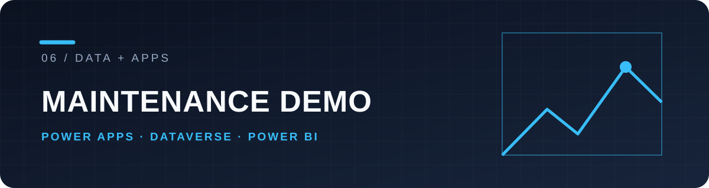

# Pharma maintenance · Power Platform demo

An **independent portfolio project** using synthetic equipment and maintenance data. It demonstrates a technician-facing Canvas app, Dataverse tables, an alert flow and a Power BI report.

> This is not a Takeda product or deployment. No employer, patient, or proprietary data is included.

## Workflow

```text
Technician log in Power Apps
          ↓
Dataverse maintenanceLog
          ├── critical status → Power Automate → AlertLogs
          └── reporting → Power BI
```

| Layer | What to inspect |
| --- | --- |
| Canvas app | [Unpacked solution](unpacked) |
| Dataverse & automation | Solution metadata under [`unpacked/`](unpacked) |
| Analytics | [`powerbi/Takeda.pbix`](powerbi/Takeda.pbix) (legacy filename) |

The unpacked solution is text-friendly for review. Importing it into a Power Platform environment requires the relevant services and environment configuration; the PBIX is for inspection in Power BI Desktop. This repository is a demonstration of structure and integration, not a hosted service or production template.

## Why this project

It shows how operational data moves from capture to rule-based handling and reporting, with the app, automation and report represented together. Technologies: Power Apps, Power Fx, Dataverse, Power Automate, Power BI, Git and the Power Platform CLI.

[License](LICENSE).
